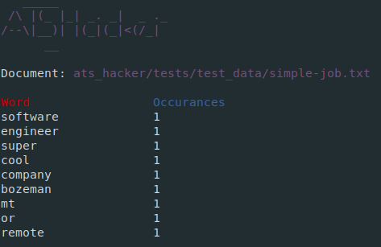

# ATS-Hacker
---
**ATS-Hacker** is a job posting keyword counter with command line and web (coming soon!) interfaces. Maximize your application's chances by making sure the most used words from the job posting are included in your resume. Counting these words manually is tedious, however, That's where ATS-Hacker comes to the rescue!

## Getting Started
---
To run ATS-Hacker, first clone the repo to your machine and install the dependencies (see below).

### CLI
Execute `python3 ats_hacker /path/to/your/job.txt` from the project's root directory for a command line output of keywords.

If there are certain words you'd like to exclude from being aggregated, you can specify an exclusion list with the `-r /path/to/words-to-exclude.txt` flag. The file should be a plain text list of words, each separated with a newline.

`python3 ats_hacker -h` displays usage help and additional command line options.

### Web Interface
For running the developmental version of the ATS-Hacker web interface, run `python3 ats_hacker -web` in the project's root directory. You can then navigate to `localhost:5000` in your web browser to utilize the service.

**ATS-Hacker is currently in development. See the [CONTRIBUTING](CONTRIBUTING.md) guidelines if you'd like to jump in and help.**

### Installing Dependencies
From the project's root directory, run `pip install -r requirements.txt`. This will install all required dependencies for ATS-Hacker.

### Testing
To run the test suite, execute `pytest` in the project's root directory.

## Built With
---
* Python3
* CLI enhancements using pyfiglet and clint.

## Authors
---
**Jamie Rodriguez** - [JaimeVRodriguez](https://github.com/JaimeVRodriguez)

**Zach Wahrer** - [zachtheclimber](https://github.com/zachtheclimber)

## License
---
ATS-Hacker is licensed under the GNU General Public License. Check out the [LICENSE](LICENSE) for more details.
